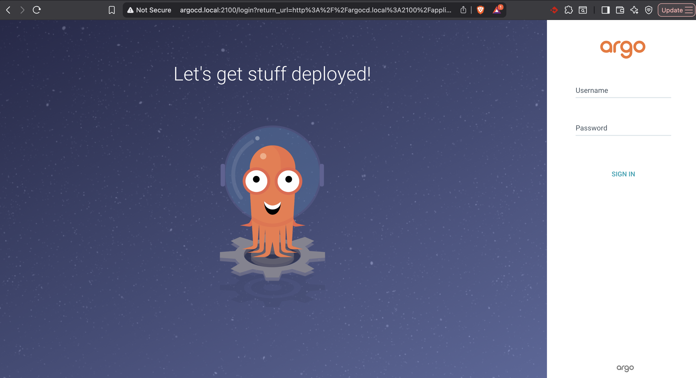

# 🐙 ArgoCD Setup (GitOps)

## ¿Why ArgoCD?
I've implemented ArgoCD to automate my homelab deployment process. This allows the cluster to automatically synchronize with this GitHub repository, eliminating the need for manual commands (`kubectl apply`).

## Step-by-step installation

#### Pre-requisites
- `helm`
- `Docker`
- `k3s`

1. **Create Namespace:**
   `kubectl create namespace argocd`

2. **Create ArgoCD config file**
In this case I created it on `apps/deployment/argocd-config.yaml`this file lets us configured features like cpu and memory limit to prevent resources saturation. 

3. **Add the Argo CD Helm repository and update:**
```bash
helm repo add argo https://argoproj.github.io/argo-helm
helm repo update
```

4. **Install ArgoCD using our custom config**
```bash
helm install argocd argo/argo-cd -n argocd -f apps/deployment/argocd-config.yalm
```

Or you can install using the default settings
```bash
helm install argocd argo/argo-cd --namespace argocd
```

5. **Verify installation**
```bash
kubectl get pods -n argocd
```

6. **Get initial credentials and login first-time**
After reaching the UI the first time you can login with username: `admin` and the random password generated during the installation. You can find the password by running:
```bash
kubectl -n argocd get secret argocd-initial-admin-secret -o jsonpath="{.data.password}" | base64 -d
```

7. **Expose the service using an ingress file**
Created an ingress so I can access my service from outside the cluster. 
```bash
kubectl apply -f cluster/k3d-argocd-ingress.yaml
```

