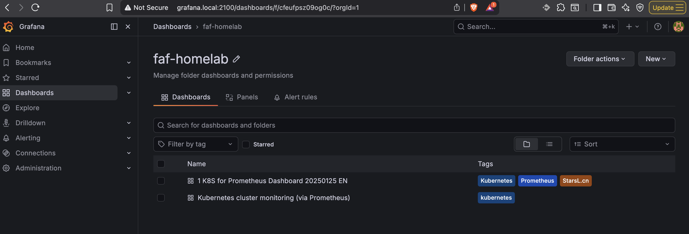

## Monitoring Setup

I'm creating this doc to document the setup process of creating a monitoring stack using Helm. 

### Pre-requisites

First thing you need to have is Helm installed. You can installed it on MacOS/Linux using HomeBrew: 
```bash
brew install helm
```

### 1. Add prometheus-community to your repo
```bash
helm repo add prometheus-community https://prometheus-community.github.io/helm-charts
```
After that update you Helm repo
```bash
helm repo update
```

### 2. Get the repo name
This is optional, but if you want to check and be sure that you got the repo you can get the name of the repo by using: 
```bash
helm search repo prometheus-community/kube-prometheus-stack
```
If everything is ok you'll get an output like this: 
```bash
NAME                                            CHART VERSION   APP VERSION     DESCRIPTION                                       
prometheus-community/kube-prometheus-stack      82.4.3          v0.89.0         kube-prometheus-stack collects Kubernetes manif...
```

### 3. Create a YAML file to store the prometheus/grafana configs
In my case I created it on `apps/observability/prometheus-config.yaml`

### 4. Create a new namespace 
You can create the new namespace with: `kubectl create namespace monitoring`

### 5. Install the monitoring stack
```bash
helm install monitoring-stack prometheus-community/kube-prometheus-stack --namespace monitoring -f apps/observability/prometheus-config.yaml
```
### 6. Create and Apply Ingress to access monitoring
```bash
kubectl apply -f cluster/k3d-grafana-ingress.yaml 
```

Now you can go to your monitoring GUI, in my case is in: `http://grafana.local:2100/`

### 7. Update prometheus config

If I make a change or create new dashboard I can update bi: 
```bash
helm upgrade monitoring-stack prometheus-community/kube-prometheus-stack --namespace monitoring -f apps/observability/prometheus-config.yaml
```
