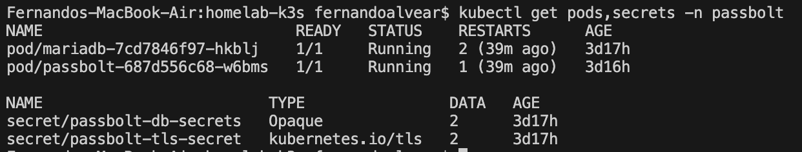
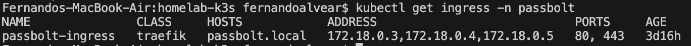
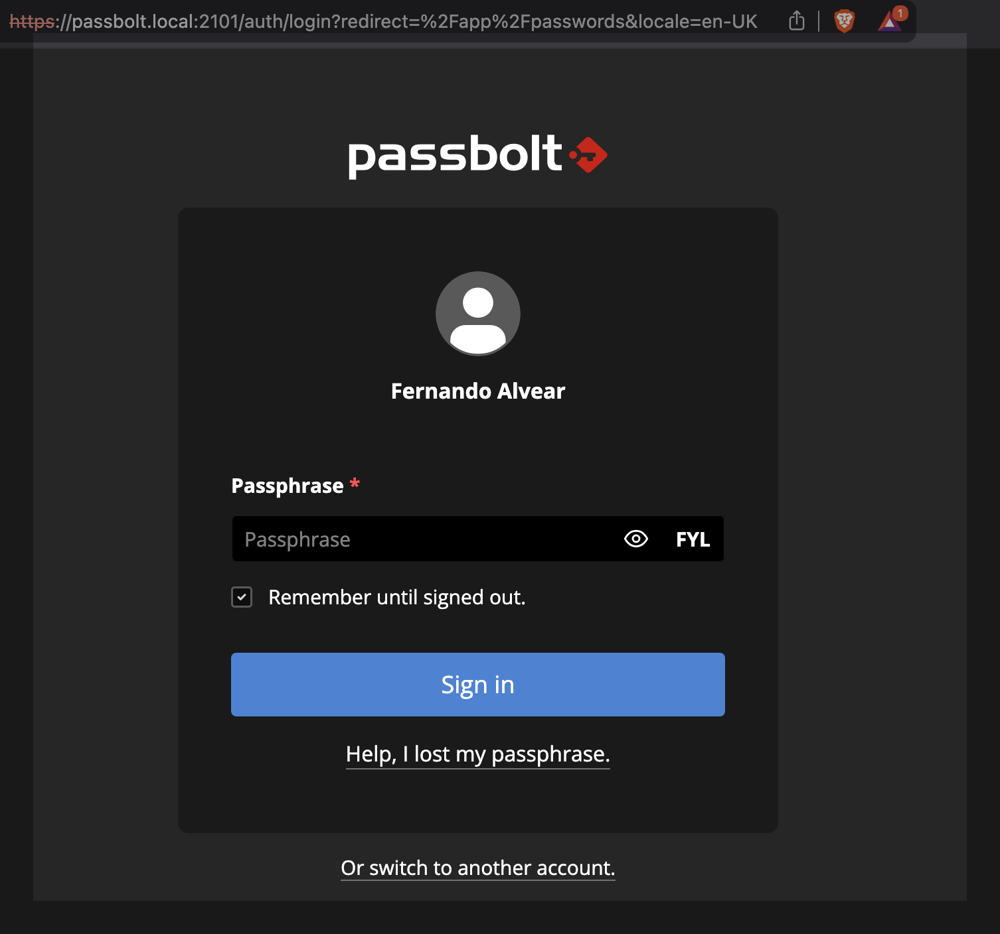

## Passbolt setup 

Once the cluster is online fresh and new let's do a walkthrough on the process to enable passbolt service: 

#### 1. Create cluster 
If you don't need .env variables, just run 
```bash
k3d cluster create --config cluster/k3d-config.yaml
```

In order to keep env variables in memory while deploying the cluster use: 
```bash
export $(grep -v '^#' .env | xargs) && k3d cluster create --config cluster/k3d-config.yaml
```

#### 2 Create passbolt namespace
```bash
kubetl create namespace passbolt
```

#### 3. Create mariaDB secrets
Next we create the database secrets in order to enable mariadb service and deployment. We do that by: 
```bash
kubectl create secret generic passbolt-db-secrets -n passbolt --from-literal=mariadb-password=<SecurePassword> --from-literal=mariadb-root-password=<SecurePassword> 
```
#### 4. Create mariaDB service
After creating the secrets we can now apply our mariabd config file: 
```bash
kubectl apply -f apps/passbolt/mariadb.yaml
```

#### 5. Create tls secrets
In order to be able to ensure ssl connection we need to create out tls secret using: 
```bash
kubectl create secret tls passbolt-tls-secret --key passbolt.local.key --cert passbolt-local.crt -n passbolt
```

We can see that our secrets and pods are up: 


#### 6. Create passbolt service
Now we create our passbolt service using our config file
```bash
kubectl apply -f apps/passbolt/passbolt-app.yaml
```

#### 7. Create passbolt ingress 
After the service is created, we need to create an ingress in order to access to it
```bash
kubectl apply -f cluster/k3d-passbolt-ingress.yaml
```



### 8. Create passbolt admin user 
```bash
kubectl exec -it <passbolt-pod-name> -- su -c "bin/cake passbolt register_user -u <email> -f <firstname> -l <lastname> -r admin" -s /bin/bash www-data
```



